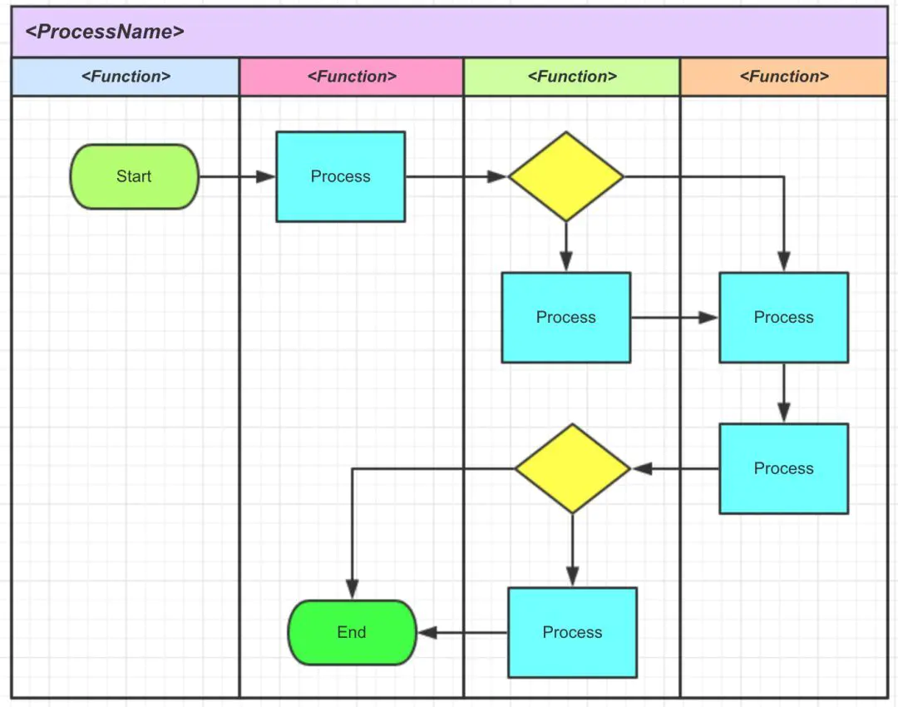
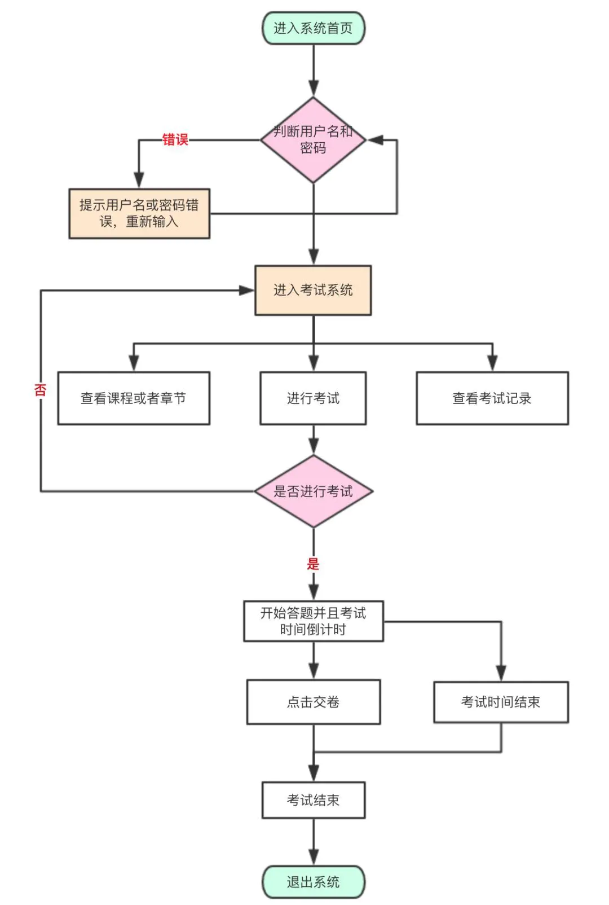
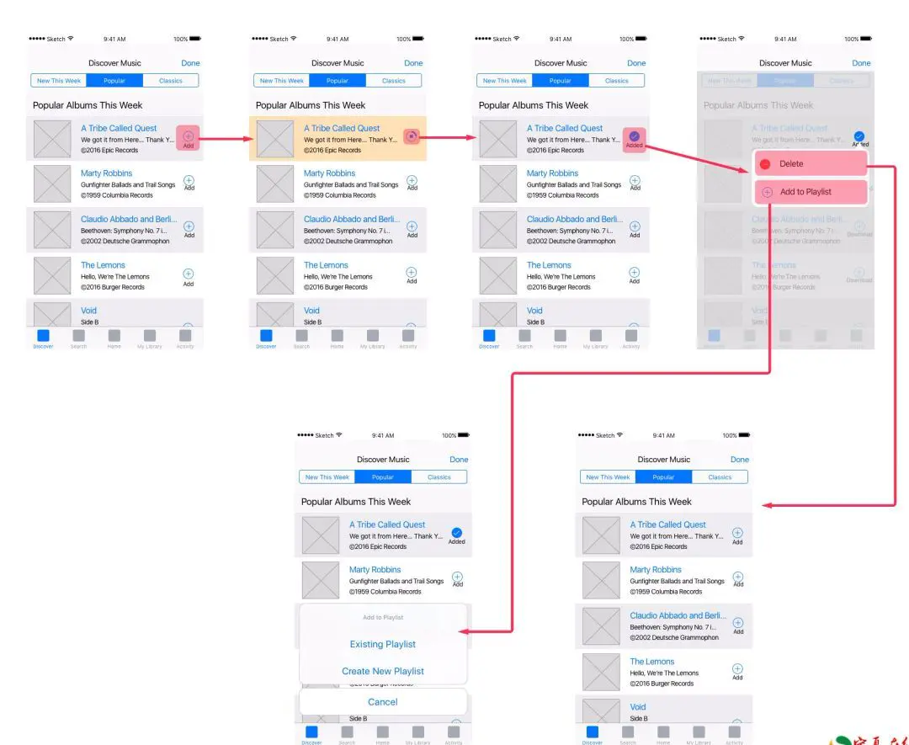
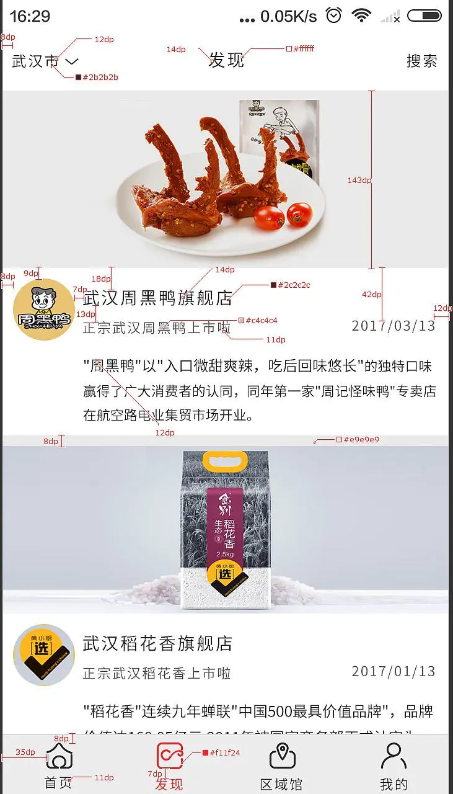
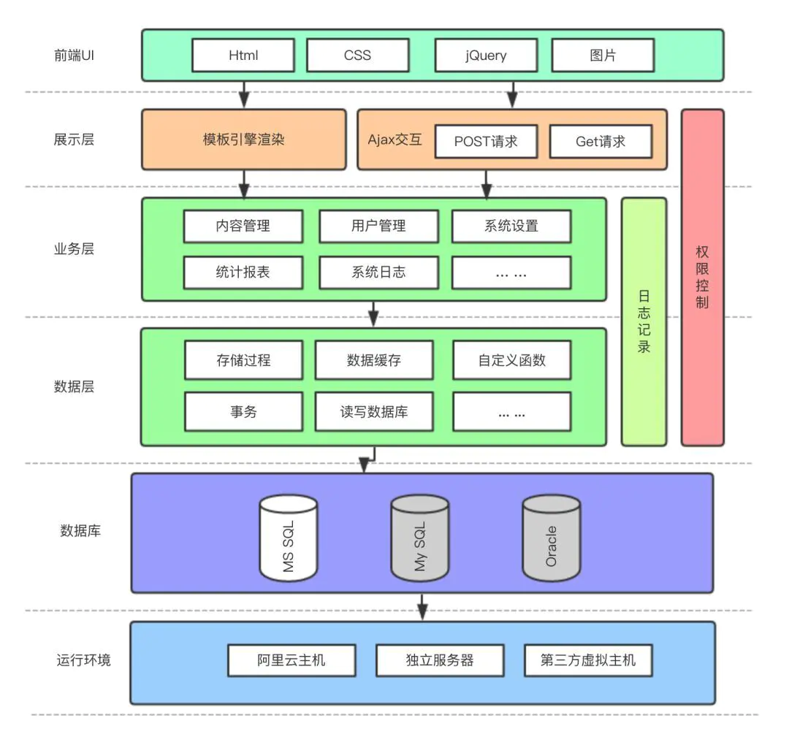
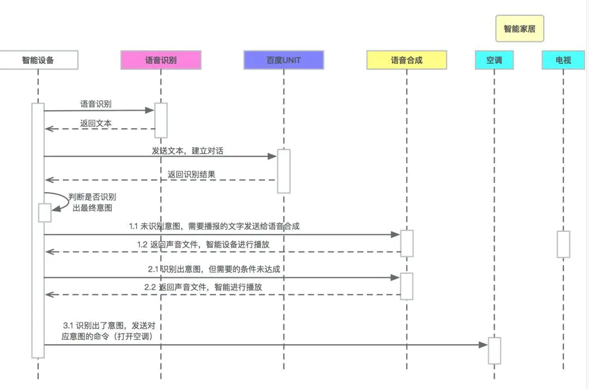
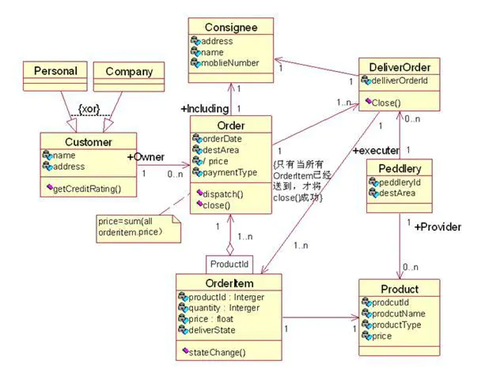

# 架构

[原文地址](https://www.jianshu.com/p/2a5d5ea93ebd)

## what
> 掌控整体，洞悉瓶颈，给出解决方案，考虑拓展性，为客户提供需求清单

## how
* 丰富的软件设计与开发经验
* 领导能力&团队协作能力，关键时候对技术做出及时、有效的决定
* 很强的沟通能力，与客户、市场人员、开发人员、测试人员、项目经理、网络管理员、数据库工程师等

## 流程图

### 1. 业务流程图

* 涉及哪些主体
* 每个主体任务
* 主体间的联系

### 2. 任务流程图
> 产品级流程，细化业务流程

### 3. 页面流程图
> 梳理页面跳转关系，给前端用

### 4. UI 设计图标注
> 标注页面细节参数，如字号、字体、RGB颜色等

### 5. 系统架构设计图
> 架构不断演化、精炼

### 6. 序列图
> 架构师进行详细设计，梳理程序模块间调用关系，给到开发进行开发

### 7. 类图
> 描述数据库表结构之间关系

